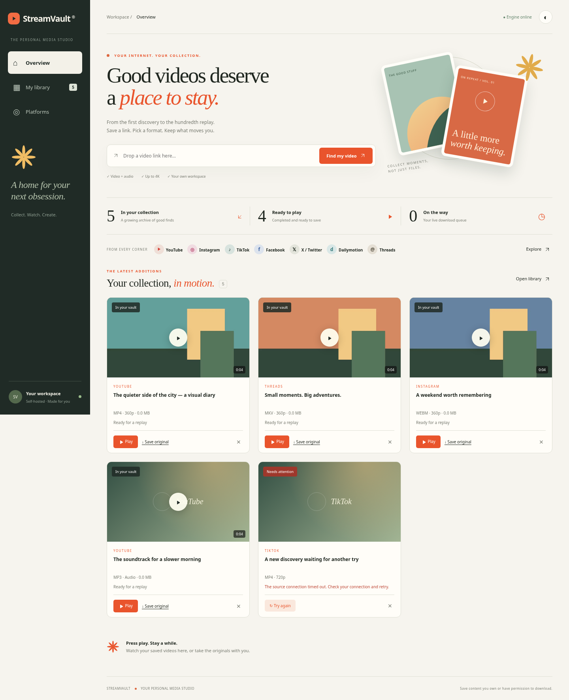

# StreamVault

A self-hosted online video downloader with a responsive dashboard, live download queue, quality selection, audio extraction, search, dark mode, local video thumbnails, and an in-app media player. Built with FastAPI, yt-dlp, FFmpeg, and a lightweight browser interface.



## Windows quick start

Install Python 3.12, FFmpeg, and Deno as described below. Extract the complete project ZIP, then double-click **Start StreamVault.bat** in the folder containing this README. On first launch it prepares the Python environment if needed; if a working `.venv` is already in the parent folder, it reuses it. The dashboard opens when ready. Keep the console window open, and press **Ctrl+C** to stop. If port 8000 is already occupied by an older copy, stop that copy first.

To update an existing installation, stop the app, download the latest main-branch ZIP from GitHub, and copy its project files into the existing folder. Keep your **data/** folder, **.venv/** folder and any **.env** settings. The ZIP does not include these local files. Existing dependencies are retained by the launcher; run `python -m pip install --upgrade "yt-dlp[default,curl-cffi]"` with your virtual environment's Python if source-site changes require an extractor update. A previous version kept history only in memory; only downloads created with the persistent-history version are recoverable from its database.

## Run on your computer

Requires **Python 3.12+**, **FFmpeg on PATH**, and **Node.js 22+ or Deno 2.3+** for full YouTube support. Install FFmpeg with your OS package manager (for example `brew install ffmpeg` on macOS or `winget install Gyan.FFmpeg` on Windows). The app enables detected Node and Deno runtimes; its dependency lock includes yt-dlp's companion EJS scripts.

On Windows, install the JavaScript runtime with `winget install --id DenoLand.Deno -e --source winget`. Close and reopen PowerShell afterward, then verify `deno --version`. Node.js LTS is also supported. Official runtime/dependency guidance: https://github.com/yt-dlp/yt-dlp/wiki/EJS.

```bash
python -m venv .venv
# Linux / macOS
source .venv/bin/activate
# Windows PowerShell: .venv\Scripts\Activate.ps1
pip install -r requirements.lock
python -m uvicorn app.main:app --host 127.0.0.1 --port 8000
```

Open `http://127.0.0.1:8000` on your computer. Paste a public video URL, analyze it, choose an output format and maximum resolution, and add it to the queue. After processing, click **Play** to watch or listen inside the dashboard, or **Save original** to download to your device. The library displays local thumbnails for completed videos. The player supports native controls, seeking, volume and fullscreen where the browser provides them; Escape or the close button stops playback.

Supported URL families: YouTube, Dailymotion, Facebook, TikTok, Instagram, Threads, and X/Twitter. Actual extraction depends on yt-dlp and the source. Login-required, private, DRM-protected, geographic, age-restricted, and live content are not guaranteed. There is no DRM or authentication bypass. Use content you own or have permission to download.

Output formats: **MP4, WebM, MKV, MP3, M4A, WAV**. The video quality setting is a maximum, not an upscaler. Sources with missing resolution metadata are probed and scaled down after download when necessary. Video-only sources can be saved; the history row labels files with no audio track. MP4 works on most devices; conversion to some containers can be slow. Audio quality is configured at 192 kbps where applicable.

## Server operation

Run the same app on a server with Python, FFmpeg, and a supported JavaScript runtime. A single-owner HTTP Basic login protects all routes when **STREAMVAULT_PASSWORD** is set; **STREAMVAULT_USERNAME** defaults to `admin`. Public mode (`STREAMVAULT_PUBLIC=true`) rejects requests until a password is configured. Always put online instances behind **HTTPS**, because Basic authentication depends on transport encryption. The app is a shared owner workspace, not a multi-tenant service. Add proxy request limits and enforce outbound network filtering (block private/link-local addresses), CPU/time limits, and disk quotas before Internet deployment. URL validation allows supported HTTPS site names, but extractor-generated redirects and media requests also need network-level filtering. Browser mutations are restricted to the current origin, and repeated failed logins are throttled.

`DOWNLOAD_DIR` optionally changes storage (default `data/`). Two downloads run concurrently, with up to ten active/queued jobs and one hundred history entries. A 2 GiB source-file limit is applied when yt-dlp can determine the size; enforce a filesystem quota for a hard limit. New downloads are refused by the worker when less than 256 MiB is free. Completed files remain until removed. Removing a history entry deletes its file. Video posters and compatible browser previews are stored in each job's **_preview/** directory. MKV, WebM and MP4 files with incompatible codecs receive an H.264/AAC MP4 preview; the original download remains unchanged. Preview preparation can add processing time and disk usage. A preview failure does not discard a successful original download; the dashboard offers Save original instead. Older completed jobs can prepare posters/previews on first access. A source thumbnail is shown during analysis when available, with a visual fallback when unavailable. Metadata is saved in **data/history.sqlite3** and survives restarts. Interrupted jobs become failed and can be restarted with **Retry**. Back up the whole data directory while the app is stopped to retain both history and media. Use a **single Uvicorn worker**; workers share disk metadata but do not share the active queue. Active downloads cannot currently be cancelled.

The `curl-cffi` dependency enables source handlers that require browser-style HTTP requests. It is not a UI browser test. On a managed network whose trusted proxy CA is already installed in the operating system, `STREAMVAULT_SYSTEM_CERTS=1` selects that trust store for yt-dlp. Supply the approved CA bundle using `CURL_CA_BUNDLE` when needed. Certificate verification remains enabled; do not use this setting to trust an unknown certificate. Ordinary laptop networks normally need no override.

No external API keys are required. Source websites and media CDN destinations must be reachable. Website changes can require updating yt-dlp (`pip install --upgrade "yt-dlp[default,curl-cffi]"`); run the tests after updates. Fonts load from Google Fonts with a local sans-serif fallback.

If analysis succeeds but download returns HTTP 403, the media server rejected access. Check terminal warnings, ensure a supported JavaScript runtime and EJS package are installed, update `yt-dlp[default,curl-cffi]`, restart the app, and retry a public video. A 403 alone does not establish which dependency or access restriction caused it, and these steps do not guarantee access to a restricted source. `/api/health` reports detected JavaScript runtimes and EJS package presence. Extractor warnings are visible in the server terminal.

## Development and validation

```bash
python -m pytest -q
node --check app/static/app.js
```

Tests cover URL rejection, API responses, format normalization, actual yt-dlp downloads of a generated local video, FFmpeg audio conversion, file delivery, deletion, history restoration, retry, low-disk errors, login protection, and cross-site request rejection. Local fixtures do not prove current access to every external platform. A user-confirmed Windows YouTube download played correctly with both picture and audio; that confirms that video on that computer, not every platform or source.

API docs are available at `/docs`. Main routes: `/api/analyze`, `/api/download`, `/api/jobs`, `/api/jobs/{id}/file`, `/api/jobs/{id}/retry`, `/api/jobs/{id}/thumbnail`, `/api/jobs/{id}/stream`, and `/api/health`. Streaming supports HTTP byte ranges for seeking and remains protected by the same owner login. Error messages deliberately avoid exposing extractor details or credentials.

## Docker alternative

```bash
docker compose up --build -d
```

The compose file binds to localhost and retains media in a named volume. FFmpeg and Node.js are bundled in the image. `docker compose down` stops the app; add `-v` only if you intend to delete saved media. Both Compose templates pass configuration validation, the image builds successfully, all 47 tests pass inside the image as the unprivileged app user, and container startup/dashboard readiness checks pass. The managed cloud build used the configured proxy route and a trusted CA bundle; TLS and package-signature verification stayed enabled. On ordinary networks, no custom CA configuration is needed. Managed TLS proxies can supply a trusted CA bundle with `docker build --secret id=build_ca,src=/path/to/trusted-ca-bundle.pem .`; the bundle is mounted only for build-time package downloads, not copied into the image. Online domain, HTTPS certificate issuance, and hosted source access still require validation on the actual server.

## Future online hosting

The optional **compose.online.yaml** template runs the app behind Caddy with automatic HTTPS and password protection. It needs a Linux server with Docker Compose, a real domain pointing to the server, and ports 80/443 reachable. It has not been deployed to a server during this task.

1. Copy `.env.example` to `.env`. Set `STREAMVAULT_DOMAIN`, your username, and a strong unique `STREAMVAULT_PASSWORD` locally on the server. Never commit `.env` or send credentials in chat.
2. Apply the outbound network restrictions, request limits and disk quotas described above for your hosting environment.
3. Run `docker compose -f compose.online.yaml up --build -d`.
4. Visit your HTTPS domain and sign in through the browser prompt. Verify analysis, an authorized test download, file delivery and history after a restart.

The app port is exposed only to the internal Docker network. This template trusts proxy headers from that internal network; do not publish the backend port directly. HTTPS certificates and live downloads require external connectivity. Hosting configuration is a template, not evidence of a published online website.

## Threads videos

Threads direct post URLs (`https://www.threads.com/@username/post/POST_ID`) and share URLs (`https://www.threads.com/share/SHARE_ID/`) are supported by the app's own extractor. It reads the public server-rendered post data and supports a single video in the post, its carousel, or its quoted attachment. It uses the public crawler page representation without account cookies or login tokens. It does not select unrelated recommended videos. Posts containing multiple videos are rejected with a specific message; profile pages and login-only posts are not supported. Source page changes can require an integration update. See [reports/threads-check.json](reports/threads-check.json) for the supplied share-link download test.

## Platform and browser verification

| Platform | Current evidence |
| --- | --- |
| YouTube | One Windows download was confirmed by the user with working picture and audio; other links can fail for source-specific reasons. |
| TikTok, Facebook, X/Twitter | Public samples completed the actual app analysis and MP4 worker pipeline; FFprobe confirmed video and audio. |
| Instagram | A public Reel completed the app pipeline; the fetched source file contained video without an audio track. |
| Dailymotion | Two public samples failed: metadata loaded, but media manifest requests returned HTTP 403. Working downloads remain unverified here. |
| Threads | A custom public-page handler resolves share links and extracts direct or quoted single videos. The supplied share-link sample completed the actual MP4 worker with audio at 720p. |

Detailed public sample URLs, byte counts and stream checks are recorded in [reports/verification.md](reports/verification.md) and the adjacent JSON reports. These are sample results, not promises for every video.

The URL allowlist currently covers the named platform families above; this app does not accept every website worldwide. Adding a platform requires an actual extractor/integration, public sample URLs and download/conversion checks, as well as updating the allowed domains. Private access, age verification, DRM, regional restrictions, removed videos, rate limits and media-server HTTP 403 errors can prevent extraction or transfer even when another video on the same platform works. Browser choice does not change the backend's source access.

Modern Chrome and Edge use Chromium, Firefox uses Gecko, and Safari uses WebKit. Chromium desktop/mobile dashboard checks have passed. Native Edge, Firefox, Safari and phone-browser testing remains separate; the cloud network blocked download of the Firefox/WebKit test engines. Theme persistence now tolerates browsers that disable localStorage, so unavailable storage does not stop the dashboard from starting. Internet Explorer and obsolete browser versions are not supported.

For each platform/browser combination, analyze a public video, download MP4 at 720p, save the file, and play both picture and sound. Test search, Retry, and retained history after restart. Record the URL, browser/version, result and terminal warnings for any failure. An accepted domain or a platform tile alone is not evidence of a successful download.
